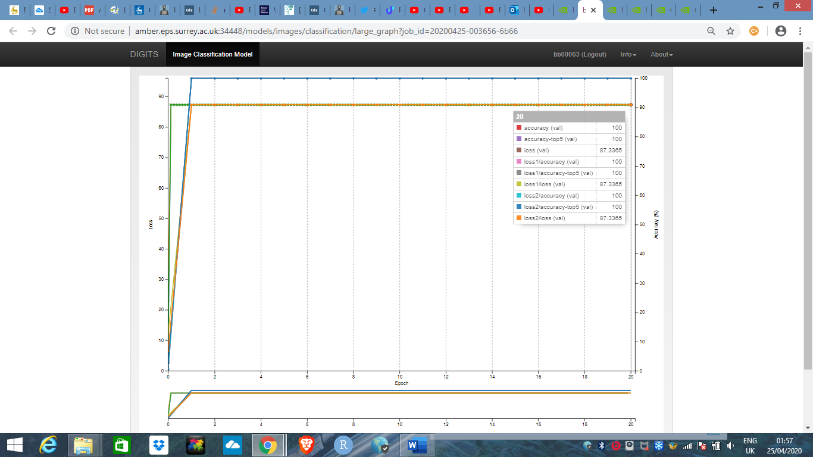

# Deep-CNN---Stanford-cars

***CONVOLUTIONAL NEURAL NETWORKS***

# **Abstract**

In this assignment, a series of experiments were conducted in order to explore the effectiveness of Convolutional Neural Networks in solving a supervised classification problem. The experiments conducted involved altering model meta-parameters such as the learning rate, number of epochs and the batch size. Additionally, different dataset splits were investigated including data augmentation techniques. Furthermore, different CNN architectures were also explored. The experiments were conducted on different CNN networks such as AlexNet and GoogLeNet. Results show that allocating most of the available data to the training dataset and increasing convolutional layers in the network lead to higher model performance. Moreover, a lower learning rate value, a lower batch size value and higher epoch values seem to result in higher model accuracy, however, they also result in longer training times and as a result are more computationally expensive.

# **Introduction**

For this assignment a series of experiments were conducted to explore the effectiveness of Convolutional Neural Networks in solving a supervised classification problem.

The task involved using different CNN networks and architectures, altering meta-parameters and data augmentation methods in order to find ways to increase model performance.

The ‘‘Stanford *cars’’* dataset was used for this assignment. It includes around 16000 images compromising 196 make of American cars (60-90 images of each car).
# **Meta-parameters**
## ***Experiment 1*** 
CNN: AlexNet - Dataset split: (80:10:10) - learning rate: 0.01 – epoch: 30

The first experiment conducted involved splitting the dataset into 80% training, 10% validation and 10% testing, as it is usually recommended to use most of the data available for training. The AlexNet network was used with a learning rate of 0.01 and epoch number at 30 (default positions).  The resulting graph, plotting the model’s Loss vs epoch can be seen in figure 1.

` `

*Figure  SEQ Figure \\*  1 CNN: AlexNet - Dataset split: (80:10:10) - learning rate: 0.01 – epoch: 30*

The blue line represents the training loss at each epoch, the green line represents the validation loss and the orange line represents the validation accuracy. The validation accuracy gives a very good indication on how the model will perform on unseen data (testing data).  It can be seen from the graph that the validation accuracy is at 17.5%. This, in fact is very low and shows that the model is not doing an adequate job at classifying the images correctly.

The model was then tested using the test data. First using a single image and then using a list of images. The model’s single image accuracy was much lower than the overall validation accuracy. It classified the car correctly with a probability of only 8.1%.  In multiclassification it did much worse, accurately classifying images with only around 4% accuracy. Both the results for single-image and multi-image classification are shown in figures 2 and 3 respectively in the appendix.
## ***Experiment 2***
CNN: Alexnet - Dataset split: (80:10:10) - learning rate: 0.1 – epoch: 20

In the following experiment the learning rate was increased by one order magnitude to 0.1 and the number of epochs reduced to 20, with the assumption that with a much higher learning rate the model would converge faster. The corresponding graph is shown on figure 4 in the appendix.

From the graph, one can observe that with the much higher learning rate, the model failed to do any learning at all giving a validation accuracy of around 0.85%.  The training loss got stuck at a high value (due to the higher learning rate overshooting the minimum )and as a result the model did not converge at all. 
## ***Experiment 3***
CNN: AlexNet - Dataset split: (80:10:10) - learning rate: 0.001 – epoch: 90

Due to the poor model performance achieved in experiment 2, which had a high learning rate and a low number of epochs, in this experiment the learning rate was reduced by one order magnitude (from the default position of 0.01) to 0.001 and the epoch number increased threefold to 90.

Figure 5 shows (appendix) that this model achieved a much higher validation accuracy than the previous experiment (10.1%). However, this is still lower than the accuracy achieved with default positions of learning rate and epoch (0.01 and 30 respectively), which had a validation accuracy of 17.5%. The training loss is decreasing with every iteration due to the lower value of the learning rate. However, the training loss was not able to achieve full convergence within the 90 epochs and an increased epoch number would likely result in the model fully converging.
## ***Experiment 4***
CNN: AlexNet - Dataset split: (80:10:10) - learning rate: 0.001 – epoch: 200 batch size: 26

Following the results from experiment 3, the batch size (number of samples propagated through the network) seemed a good parameter to explore. Generally, it is recommended to decrease the batch size as you decrease the learning rate. As a result, the batch size was reduced to a low level of 26 from 128. The epoch number was now increased to 200 to accommodate the low values of batch size and learning rate.  

From figure 6 (appendix), one can observe that the validation accuracy increased significantly to 44.5%, after reducing the batch size and increasing the epoch value. This is a considerable jump (difference of about 34.4%) in comparison to Experiment 3, where the learning rate was the same but with a lower epoch value and higher batch size. This model also outperforms the model from Experiment 1, which had a validation accuracy of 17.5%. 

It is important to note however, that although smaller values for learning rate and batch size might be better for training, they will take considerably longer times to train the model. As a result, from a practical point of view, availability of resources and computational costs will have an impact on model performance. 

This model, being the one with the highest validation accuracy was then tested using the test dataset, in order to measure its actual performance and compare how well it generalise on unseen data.

It was tested first using a single image and then using a list of images (around 40 images). The model’s single image accuracy was lower than the overall validation accuracy. It classified the car correctly with a probability of around 35% ( almost 10% lower) .  In multiclassification it did much better, accurately classifying images with around 48% accuracy, which is in the same area as the validation accuracy. Therefore, the model’s accuracy represents its power to generalises among a list of images, rather than predicting every image with an accuracy of 48%. Figure 7 and 8 (appendix) show results for both the single-image and multi-image classifications. 

Furthermore, it was interesting to evaluate if the same results can be replicated by using a different CNN network. As a result, similar experiments were conducted on the GoogLeNet CNN.
## ***Experiment 5***
CNN: GoogLeNet - Dataset split: (80:10:10) - learning rate: 0.01 – epoch: 30 

In this experiment the data was split to 80:10:10 (training, validation and testing). The learning rate and epoch were kept at the default values of 0.01 and 30 respectively.

For this model, the validation accuracy reached around 4.28% (as shown in figure 9). This is a big discrepancy in comparison to the AlexNet CNN with the same configuration and dataset, which had a validation accuracy of 17.5%. This highlights the differences between the two different networks. GoogLeNet is a CNN consisting of 22 layers which has Inception Modules, performing different sizes of convolutions and concatenating the filters for the next layer, while AlexNet is made up of 8 layers, with layer input provided by one previous layer instead of a filter concatenation.
## ***Experiment 6***
CNN: GoogLeNet - Dataset split: (80:10:10) - learning rate: 0.1 – epoch: 20

As the previous experiment gave a very poor performance, in this instance the learning rate was increased to 0.1 and epoch reduced to 20. 

As can be seen in figure10 (appendix), the losses for this model start at low values at the initial stage of the experiment and increase with every epoch, instead of decreasing incrementally as seen in the previous model. This suggest that the learning rate overshot the minimum, and as result the training losses started to diverge leading to higher and higher losses. As a result, one can conclude that the learning rate is too high and should be reduced.
## ***Experiment 7***
CNN: GoogLeNet - Dataset split: (80:10:10) - learning rate: 0.001 – epoch: 90

In this experiment the learning rate was reduced to 0.001 and epoch number increased to 90. 

The graph in figure 11 (appendix) shows an overall validation accuracy of 27.0% was achieved. This is a much higher accuracy than that obtained using by the Alexnet CNN (10.1%) ,with the same configuration.
## ***Experiment 8***
CNN: GoogLeNet - Dataset split: (80:10:10) - learning rate: 0.001 – epoch: 200 - batch size: 26

In this experiment, the aim was to decrease the batch number to 26, increase the number of epochs to 200 and keep the learning rate at 0.001. This combination of values gave a model with the highest validation accuracy for the Alexnet CNN (44.5%).

*Figure  SEQ Figure \\*  2 CNN: GoogLeNet - Dataset split: (80:10:10) - learning rate: 0.001 – epoch: 200 - batch size: 26*

It can be seen from the graph above, that the validation accuracy increased significantly to 65.1%. This model gives the highest accuracy out of all the other models using the GoogLeNet network and outperforms the best AlexNet model by around 20%. The increased number of layers in GoogLeNet  have resulted in a model that can generalise much better given the same dataset.

Testing was also conducted on this model. It achieved a 99% accuracy on a single image classification, which signify it had learned features present in that specific image very well. In multi-image classification the accuracy was around 59% (lower by 6% to the validation accuracy), showing the true power of the model to generalise on unseen data. The test accuracy of the multi-image classification was also around 10% higher than that achieved by the best AlexNet model (48%). Single-image and multi-image classification results can be seen on figures 13 and 14 respectively (appendix).    

|||**GoogLeNet**||
|:-|:-:|:-:|:-:|
| ||***Learning rate***||
|***Epoch***|**0.001**|**0.01**|**0.1**|
|**20**|/|/|/|
|**30**|/|4.28|/|
|**90**|27|/|/|
|**200**|65.1|/|/|
*Table 2 GoogLeNet - Val.Accuracy (%) from all experiments*

|||**AlexNet**||
|:-|:-:|:-:|:-:|
|||***Learning rate***||
|***Epoch***|**0.001**|**0.01**|**0.1**|
|**20**|/|/|0.85|
|**30**|/|17.5|/|
|**90**|10.1|/|/|
|**200**|44.5|/|/|
*Table 1 AlexNet – Val.Accuracy (%) from all experiments*

Comparing the two models, one can observe that both achieved a much higher performance (accuracy) with a low learning rate value, higher values of epoch number and a low batch size value. The discrepancy between the validation and testing accuracy was also lower in the AlexNet network (around 4%) than GoogLeNet (around 6%). Furthermore, the best performing AlexNet model started to converge at around 80 epochs, which is higher by around 10 epochs in comparison to the best GoogLeNet model. It is important to remember also, that the best GoogLeNet model outperformed the best Alexnet model by around 20%. GoogLeNet therefore outperforms AlexNet both in terms of time and accuracy. 

||**AlexNet**|**GoogLeNet**|
| :- | :-: | :-: |
|α=0.1,epoch=20|0.85|- |
|α=0.01,epoch=30|17.5|4.28|
|α=0.001,epoch=90|10.1|27|
|α=0.001,epoch=200|**44.5**|**65.1**|
*Table 3 AlexNet vs GoogLeNet (Validation Accuracy)*

From the experiment conducted it is possible to conclude that smaller learning rates require more training epochs due to the smaller changes made to the weights on each update, resulting in a longer time before convergence.  On the other hand, larger learning rates display quicker changes and require lower epochs, however convergence is not guaranteed, and divergence is also possible if the learning rate overshoots the minimum. Smaller batch sizes also are more suitable when a small learning rate is applied, as the updates being implemented are also small. In future work more optimisers along SGD can also be investigated such as Adam, Adagrad and Momentum which is also a great way to combat the local minima problem. Additionally, manually choosing hyper-parameters is very time consuming and might not be the best way to find the right solution. One should look at picking hyper-parameters automatically using methods such as Grid search and Population-based training (which uses genetic algorithms) [1].     
# **Dataset**
The effect of different splits between training, validation and testing datasets on the performance of the model were also investigated.
## ***Experiment 9***
CNN: AlexNet - Dataset split: (60:30:10) - learning rate: 0.001 – epoch: 200 - batch size: 26

In experiment 9, the dataset was split again into 60% training, 30% validation and 10% testing (60:30:10). The learning rate, epoch and batch size were kept the same as in experiment 4, as these combinations of values gave the highest accuracy for the Alexnet network.

From figure 15 (appendix), one can observe that the validation accuracy of this model dropped to 32.8% from 44.5% (when the data was split 80:10:10).
## ***Experiment 10***
CNN: AlexNet - Dataset split: (90:9:1) - learning rate: 0.001 – epoch: 200 - batch size: 26

Next, the dataset was split increasing the training data to 90%, with validation at 9% and leaving only 1% for the testing data (90:9:1).

Figure 16 (appendix) shows that the model’s accuracy increased to 51.2%, an improvement of about 7% from the previous best performing model. 

This experiment was also repeated for the GoogLeNet network. The results can be seen below.
## ***Experiment 11***
CNN: GoogLeNet - Dataset split: (60:30:10) - learning rate: 0.001 – epoch: 200 - batch size: 26

Figure 17 (appendix) shows the validation accuracy dropping to 53.7% from previous highs of 65.1% (80:10:10 split). 
## ***Experiment 12***
CNN: GoogLeNet - Dataset split: (90:9:1) - learning rate: 0.001 – epoch: 200 - batch size: 26

*Figure  SEQ Figure \\* ARABIC 3 CNN: GoogLeNet - Dataset split: (90:9:1) - learning rate: 0.001 – epoch: 200 - batch size: 26*

Figure 18 shows the accuracy increasing significantly to 72.5%. This outperforms all other models conducted so far.
## ***Experiment 13***
CNN: AlexNet - Dataset split: (90:9:1) - learning rate: 0.001 – epoch: 200 - batch size: 26 – Data augmentation applied

Finally, data augmentation techniques were used to increase the amount of data for training.  It is important to note that the augmented data should be applied only to the training data, as the validation and testing data should always use real world data in order to examine the model’s performance in the real world. In this experiment a rotational layer was added into the AlexNet network right after the data layer. The resulting effects on the model can be seen on figure 20 (appendix). 

After training, the model achieved a validation accuracy of 51.8% which is slightly higher in comparison to what it had achieved in experiment 10 when data augmentation techniques were not applied.

*Figure 21 Training data(%) vs Val.Accuracy*

Gathering all the data, one can observe that in both networks (GoogLeNet and AlexNet), the 90:9:1 split gave an increase in the validation accuracy, while splitting the data into 60:30:10 resulted in decreased performance. It can be concluded therefore that splitting the dataset in a way that allocates most of the data to the training dataset, will greatly increase the performance of any model. This is because when a model is trained on a large and diverse dataset it will be able to generalise much better to real-world data, simply since real-world data is diverse and complex. 

Increasing the validation data will decrease the discrepancy between the test and validation accuracy, as a result one will be able to predict how the model will perform on unseen data much more accurately, using the validation dataset. It is also important to note that although allocating most of the data to the training dataset is recommended, having a very limited non-diverse test data could give false performance metrics in the testing phase that could not be replicated in the deployment phase. As a result, allocating most data to the training dataset, while at the same time, keeping a healthy balance between validation and testing datasets is important. In order to reduce effects such as overfitting, the quality of data is also important to prevent the model from learning detail and noise in the training data. 

Additionally, results from data augmentation techniques also reinforce the findings in experiment 10 and 12 where an increase in training data resulted in better model performance. Data augmentation reduces overfitting, but it is also a much more efficient way of increasing one’s dataset without acquiring new data, which can be expensive and time consuming. Exploring more complex transformations and other techniques enabled by CycleGAN would also be interesting to explore in future work.

Although it is almost undisputed that more data is crucial for better learning, especially after publications such as ‘The Unreasonable Effectiveness of Data’ released by P. Norvig (Director of research at Google) [2], it is important to note that there is some research suggesting that more data does not always result in better performance. A term referred to as *double-descent* occurs when the size of the training set is close to the number of model parameters. Work conducted by Pr. Manfred Opper [3],[4] and a much more recent conference paper submitted to ICLR ‘Double Descent: Where bigger models and more data hurt’ [5] suggests that increasing the number of training examples can have a negative effect on the performance. However, this is still mostly theoretical work and only applies in some specific instances, as a result it cannot be used as evidence to suggest that more data collection is futile.
# **CNN Architectures**
In the next stage network architectures were also investigated.
## ***Experiment 14***
CNN: AlexNet - Dataset split: (90:9:1) - learning rate: 0.001 – epoch: 200 - batch size: 26

Network: 2 convolutional layers added

First, the configurations for model with highest accuracy for the Alexnet network were chosen, achieved in experiment 10.

Then, the AlexNet network was altered by adding 2 convolutional layers into it. The result on the model performance can be seen in the following graph.

*Figure 22 CNN: AlexNet - Dataset split: (90:9:1) - learning rate: 0.001 – epoch: 200 - batch size: 26*

*Network: 2 convolutional layers added*

The results show an increase in the validation accuracy by another 6% (to 57.3%) from previous highs.

This model was also tested using the test dataset. In single image classification on the unseen data, the model achieved an accuracy of 95.21% as can be seen in the figure 23. This, however, is not very indicative of the performance of the model, as certain features learned during training perform better on some pictures than others. When the same experiment is repeated, every time with a different single image, there are some instances when the model fails to classify the image completely. As a result, a multi-classification of images was also undertaken to have a better understanding of the model’s performance. 

In multi-classification of images (figure 24), the model had a test accuracy of around 49%. This is slightly lower than the accuracy achieved with the validation dataset (57.3%), around 8% to be more specific. This is expected however, as the model was fined tuned by considering the validation dataset performance. 

This experiment was then repeated but with 2 convolutional layers removed from the network. The results can be seen below.
## ***Experiment 15***
CNN: AlexNet - Dataset split: (90:9:1) - learning rate: 0.001 – epoch: 200 - batch size: 26

Network: 2 convolutional layers removed

*Figure 25 CNN: AlexNet - Dataset split: (90:9:1) - learning rate: 0.001 – epoch: 200 - batch size: 26*

*Network: 2 convolutional layers removed*

The results show a decrease of 15.2%  in the validation accuracy (from 51.2% to 36%) compared with default network layer configuration.

In single image classification the model had a test accuracy of 81.75% as shown in figure 26 (appendix). 

In the multi-classification of images (figure 27), the model achieved a testing accuracy of around 20%, significantly lower than the 36% achieved by the validation accuracy. 

Evaluating experiments 14 and 15, one can conclude that the removal of two convolutional layers resulted in the network extracting less features from the training data and as a result, it was unable to generalise what it had learned on unseen data. It is also shown that the increase of convolutional layers has a positive effect on the performance of the final model. This is in direct agreement with what Goodfellow, Bengio and Courville highlight in their book Deep Learning (2016)[6]. They state that greater depth seems to result in better generalisation in a wide variety of tasks. 

However, infinitely adding hidden layers will not improve the network and a deeper network is also harder to train and more computationally expensive. There will also come a point where simply adding more layers will not work as the network will start to overfit the training data, resulting in poor performance on real-world data. Hinton [7] suggest one way to reduce overfitting in large networks is to use the Dropout technique. It involves randomly dropping units (along with their connections) from the neural network during training. This prevents units from co-adapting too much, resulting in significantly reduced overfitting and better improvements in comparison to other regularization methods.

# **References**

1. Mack, D., 2020. *How To Pick The Best Learning Rate For Your Machine Learning Project*. [online] freeCodeCamp.org. Available at: <https://www.freecodecamp.org/news/how-to-pick-the-best-learning-rate-for-your-machine-learning-project-9c28865039a8/> [Accessed 10 April 2020].
1. A. Halevy, P. Norvig and F. Pereira, "The Unreasonable Effectiveness of Data," in IEEE Intelligent Systems, vol. 24, no. 2, pp. 8-12, March-April 2009. [Accessed 9 April 2020].
1. Opper, M., 2020. [online] Ki.tu-berlin.de. Available at: <https://www.ki.tu-berlin.de/fileadmin/fg135/publikationen/opper/Op03b.pdf> [Accessed 9 April 2020].
1. Opper, M., 2020. [online] Ki.tu-berlin.de. Available at: <https://www.ki.tu-berlin.de/fileadmin/fg135/publikationen/opper/Op01.pdf> [Accessed 9 April 2020].
1. Openreview.net. 2020. [online] Available at: <https://openreview.net/attachment?id=B1g5sA4twr&name=original\_pdf> [Accessed 12 April 2020].
1. Goodfellow, I., Bengio, Y. and Courville, A., n.d. *Deep Learning*. 
1. Hinton, G., 2020. [online] Jmlr.org. Available at: <http://jmlr.org/papers/volume15/srivastava14a.old/srivastava14a.pdf> [Accessed 13 April 2020].

# **APPENDIX**

*Figure  SEQ Figure \\* ARABIC 4 Single image classification CNN: AlexNet - Dataset split: (80:10:10) - learning rate: 0.01 – epoch: 30*

*Figure  SEQ Figure \\* ARABIC 5 Multi-image classification CNN: AlexNet - Dataset split: (80:10:10) - learning rate: 0.01 – epoch: 30*

*Figure  SEQ Figure \\* ARABIC 6 CNN: Alexnet - Dataset split: (80:10:10) - learning rate: 0.1 – epoch: 20*

*Figure  SEQ Figure \\* ARABIC 7 CNN: AlexNet - Dataset split: (80:10:10) - learning rate: 0.001 – epoch: 90*

*Figure  SEQ Figure \\* ARABIC 8 CNN: AlexNet - Dataset split: (80:10:10) - learning rate: 0.001 – epoch: 200 batch size: 26*

*Figure  SEQ Figure \\* ARABIC 9 Single-image classification CNN: AlexNet - Dataset split: (80:10:10) - learning rate: 0.001 – epoch: 200 batch size: 26*

*Figure  SEQ Figure \\* ARABIC 10 Multi-image classification CNN: AlexNet - Dataset split: (80:10:10) - learning rate: 0.001 – epoch: 200 batch size: 26*

*Figure  SEQ Figure \\* ARABIC 11 CNN: GoogLeNet - Dataset split: (80:10:10) - learning rate: 0.01 – epoch: 30* 

*Figure  SEQ Figure \\* ARABIC 12 CNN: GoogLeNet - Dataset split: (80:10:10) - learning rate: 0.1 – epoch: 20*

*Figure  SEQ Figure \\* ARABIC 13 CNN: GoogLeNet - Dataset split: (80:10:10) - learning rate: 0.001 – epoch: 90*

*Figure  SEQ Figure \\* ARABIC 14 Singe-image classification CNN: GoogLeNet - Dataset split: (80:10:10) - learning rate: 0.001 – epoch: 200 - batch size: 26*

*Figure  SEQ Figure \\* ARABIC 15 Multi-image classification (top 5) CNN: GoogLeNet - Dataset split: (80:10:10) - learning rate: 0.001 – epoch: 200 - batch size: 26*

*Figure  SEQ Figure \\* ARABIC 16 CNN: AlexNet - Dataset split: (60:30:10) - learning rate: 0.001 – epoch: 200 - batch size: 26*

*Figure  SEQ Figure \\* ARABIC 17 CNN: AlexNet - Dataset split: (90:9:1) - learning rate: 0.001 – epoch: 200 - batch size: 26*

*Figure  SEQ Figure \\* ARABIC 18 CNN: GoogLeNet - Dataset split: (60:30:10) - learning rate: 0.001 – epoch: 200 - batch size: 26*

*Figure 19 Data augmentation layer*

*Figure 20 CNN: AlexNet – Data augmentation applied*

*Figure 23 Single image CNN: AlexNet - Dataset split: (90:9:1) - learning rate: 0.001 – epoch: 200 - batch size: 26*

*Network: 2 convolutional layers added*

*Figure 24 Multi-image CNN: AlexNet - Dataset split: (90:9:1) - learning rate: 0.001 – epoch: 200 - batch size: 26*

*Network: 2 convolutional layers added*

*Figure 26 Single-image CNN: AlexNet - Dataset split: (90:9:1) - learning rate: 0.001 – epoch: 200 - batch size: 26*

*Network: 2 convolutional layers removed*

*Figure 27 Multi-image CNN: AlexNet - Dataset split: (90:9:1) - learning rate: 0.001 – epoch: 200 - batch size: 26*

*Network: 2 convolutional layers removed*

` `PAGE   \\* MERGEFORMAT 22

